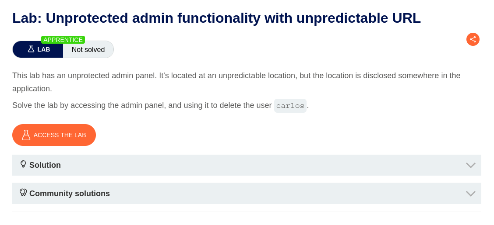
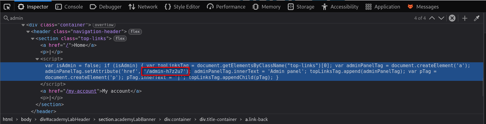
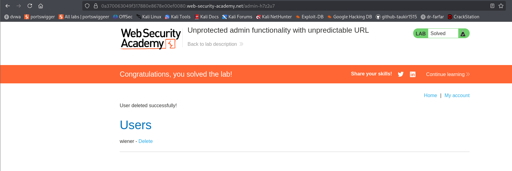
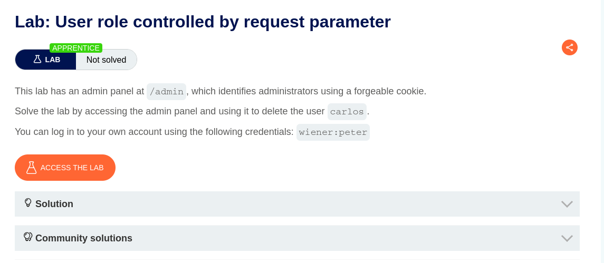
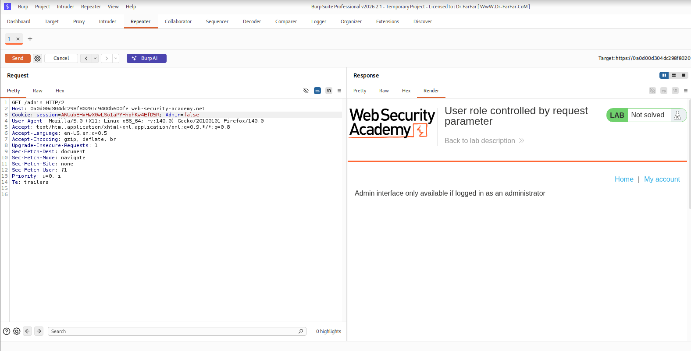
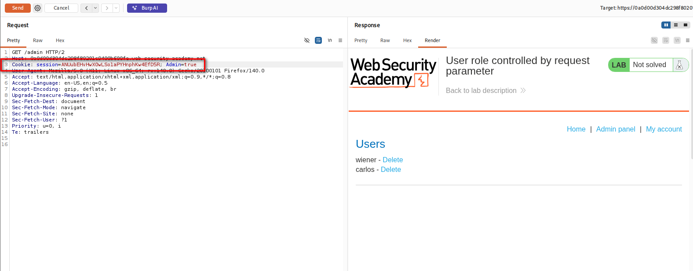
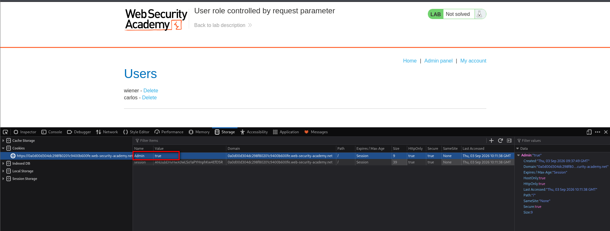
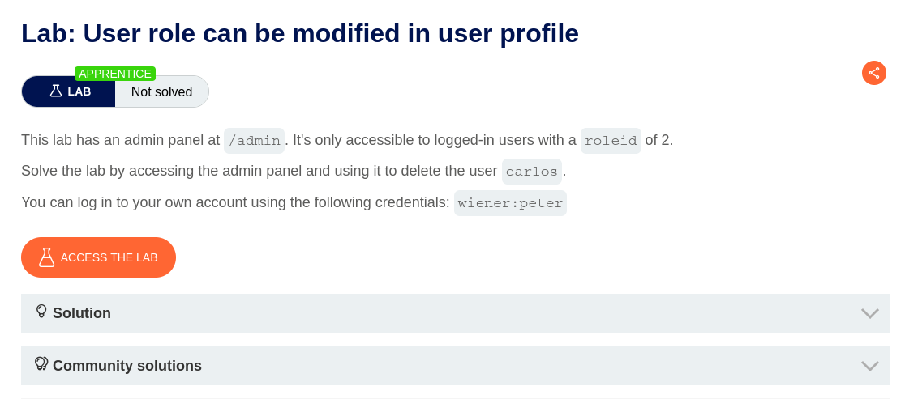
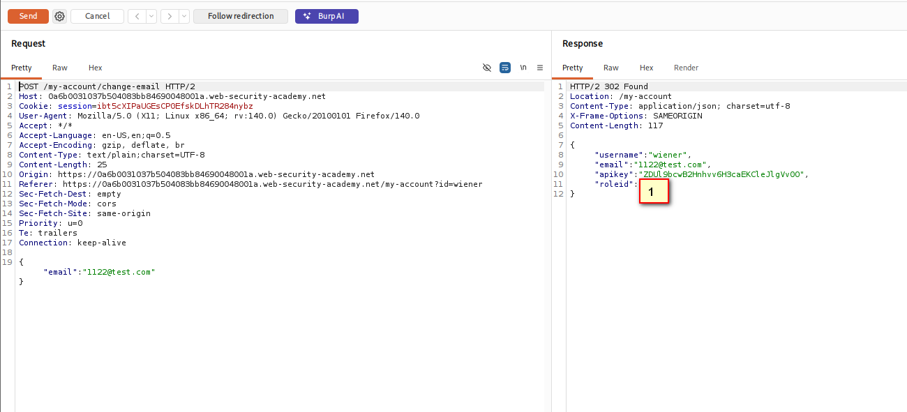
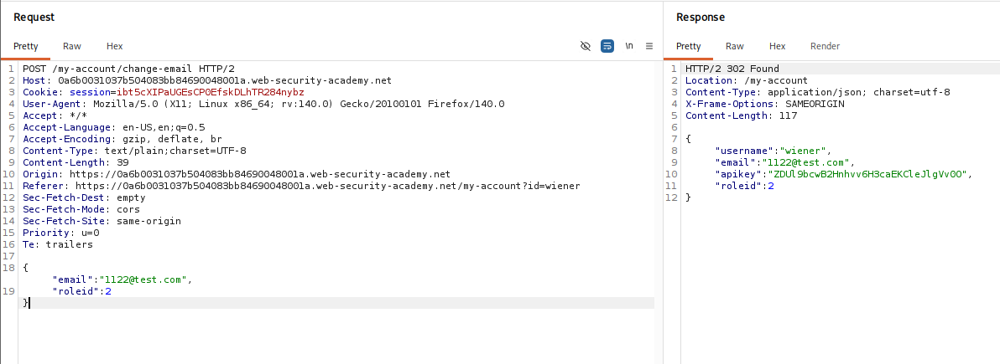

# Lab-01 Unprotected admin functionality

**Objective**


**Solution**

1. Add `/robots.txt` to the end of the URL.

```
User-agent: *
Disallow: /administrator-panel
```

2. Found the Admin Panel. Add `/administrator-panel` to the end of the URL.


3. Get access to the Admin Panel.


# Lab-02 Unprotected admin functionality with unpredictable URL

**Objective**



**Solution**

1. View Source Code
2. Check the code and find the hardcoded URL.





# Lab-03 User role controlled by request parameter

**Objective**



**Solution**
1. Access the Lab and add `/admin` at the end of the URL.
The page will not be accessible.
2. Grab the request to Burp Suite.


3. Check the cookie. Change the "false" to "true".



We can now access the Admin Panel.

4. To delete Carlos, go to URL with `/admin`.
5. Run Inspect and open Application --> Cookies or Storage --> Cookies Tab. And change `false` to `true` in Admin cookie. 
Then Reload the page.



6. Delete Carlos.


# Lab-04 User role can be modified in user profile

**Objective**



**Solution**
1. Login with existing account. 
2. Edit Email ID and capture the request.



3. Change the value of roleid in request field.



4. Reload the login page. Admin Panel Tab will appear.

